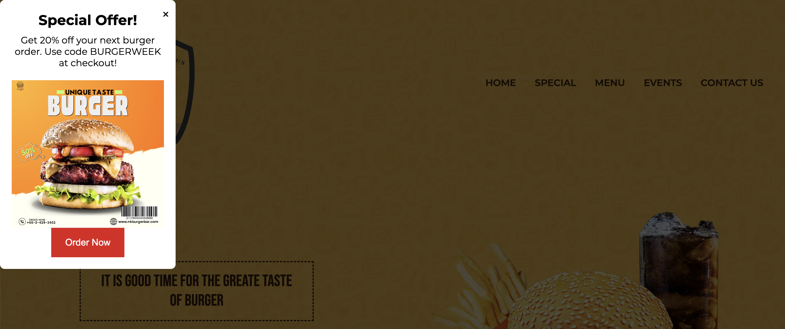

# Burger Bar Cafe : 2nd Project

Welcome to Burger Bar Cafe's official website! This project is a modern, responsive website for a burger restaurant, showcasing various menu items, special offers, and upcoming events.


## Table of Contents

- [Introduction](#introduction)
- [Features](#features)
- [Installation](#installation)
- [Usage](#usage)
- [Pop-up Advertisement](#pop-up-advertisement)
- [Technologies Used](#technologies-used)
- [License](#license)

## Introduction

Burger Bar Cafe is designed to deliver a delightful user experience by showcasing the best burgers in town. From our most popular items to special events, the site has everything to entice burger enthusiasts.

## Features

- **Responsive Design**: Optimized for all devices, ensuring a seamless experience on mobile, tablet, and desktop.
- **Pop-up Advertisement**: An engaging pop-up ad for discounts to attract customers.
- **Event Listings**: Information about upcoming events and promotions.
- **Menu Overview**: Display of featured menu items with the option to place orders directly.
- **Reservation System**: A simple form to book a table at the restaurant.

## Installation

To run this project locally, follow these steps:

1. Clone the repository:
   ```bash
   git clone https://github.com/your-username/burger-bar-cafe.git
   ```
2. Navigate to the project directory:
   ```bash
   cd burger-bar-cafe
   ```
3. Open the `index.html` file in your preferred web browser.

## Usage

- **Pop-up Advertisement**: A pop-up appears on the home page offering a discount. You can customize this feature in the `main.js` file.
- **Navigation**: The website is divided into several sections: Home, Special, Menu, Events, and Contact Us. Use the navigation bar to explore these sections.

## Pop-up Advertisement

A discount advertisement pop-up has been implemented to capture users' attention when they land on the homepage. The ad encourages visitors to take advantage of current promotions.

### Ad Preview


## Technologies Used

- **HTML5**: Structure and content.
- **CSS3**: Styling and layout.
- **JavaScript**: Interactivity and pop-up functionality.
- **Font Awesome**: Icons for social media and navigation.
- **Google Fonts**: Typography.

## License

This project is licensed under the MIT License. See the [LICENSE](LICENSE) file for more details.

## Acknowledgments

I would like to thank "Zaxel" for providing clear guidance on for the bigmack tutorial with js, html and css.


---
